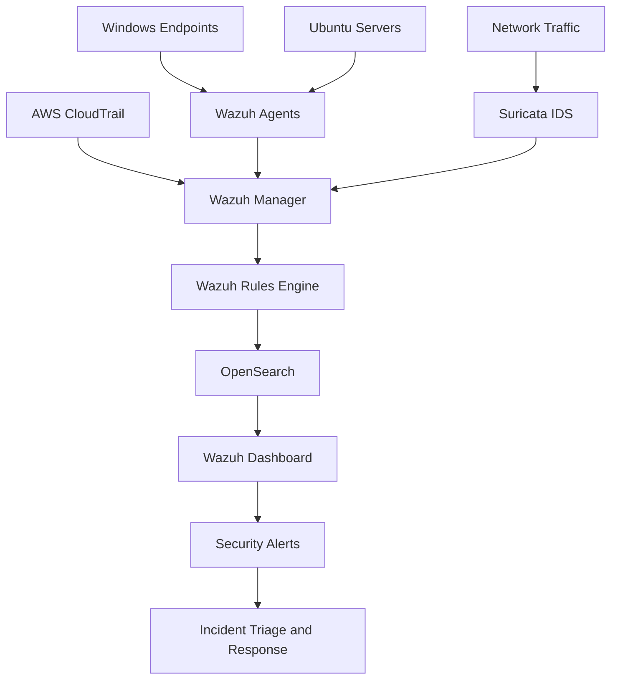
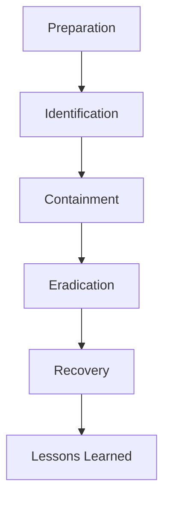

\# FireOps Security Monitoring Environment


> An enterprise-style security monitoring lab built with Wazuh, OpenSearch, Suricata, Tailscale, Windows endpoints, Ubuntu servers, and cloud telemetry.


\## Project overview


The FireOps Security Monitoring Environment was designed to simulate a distributed enterprise security infrastructure consisting of Windows endpoints, Ubuntu monitoring servers, network intrusion detection, and cloud connectivity.


The project centralises security telemetry in Wazuh, stores and analyses events through OpenSearch, and presents alerts through the Wazuh Dashboard. Tailscale provides encrypted connectivity between the distributed lab components.


Security simulations were used to validate whether the environment could detect:


\- SSH brute-force attacks

\- Network reconnaissance and port scanning

\- Privileged command execution

\- Authentication failures

\- Configuration changes

\- Administrative activity


\## Business scenario


FireOps required a central security-monitoring capability that could provide visibility across endpoints, servers, network activity, and cloud environments.


Before implementation, the organisation lacked:


\- Centralised log collection

\- Real-time detection

\- Cross-system event correlation

\- Automated security alerts

\- Structured incident-response procedures

\- Historical evidence for investigation


The monitoring environment was created to close these visibility and response gaps.


\## Architecture


The environment is organised into four layers:


## Architecture

The monitoring environment consists of four logical layers.

| Layer | Components |
|-------|------------|
| **Log Sources** | Windows Endpoints, Ubuntu Servers, AWS CloudTrail, Suricata |
| **Collection & Detection** | Wazuh Agents, Wazuh Manager, Wazuh Rules Engine, Custom Rules |
| **Storage & Analysis** | OpenSearch, Centralised Log Indexing, Historical Search |
| **Visualisation & Response** | Wazuh Dashboard, Security Alerts, Email Notifications, Incident Response |





\## Technologies used


| Technology | Purpose |

|---|---|

| Wazuh | Central SIEM, log collection and detection |

| OpenSearch | Log storage, indexing and analysis |

| Suricata | Network intrusion detection |

| Tailscale | Encrypted mesh networking |

| Docker | Containerised deployment |

| Ubuntu | Monitoring server platform |

| Windows | Endpoint telemetry source |

| AWS CloudTrail | Cloud activity monitoring |

| Hydra | SSH brute-force simulation |

| Nmap | Network reconnaissance simulation |


\## Detection rules implemented


\### SSH brute-force detection


Detects repeated failed SSH authentication attempts from a source system.


\*\*Security value:\*\* identifies password guessing and credential attacks before successful compromise.


\### After-hours login detection


Detects authentication activity outside the expected operational period.


\*\*Security value:\*\* highlights suspicious access and possible compromised credentials.


\### Privileged command execution


Monitors `sudo`, root commands, and privilege-escalation activity.


\*\*Security value:\*\* detects abuse of administrative permissions and unauthorised elevation.


\## Attack simulations


\### Scenario 1 — SSH brute force


Hydra was used to generate repeated failed SSH login attempts against the Ubuntu server.


```bash

hydra -l admin -P /path/to/passwords.txt TARGET\_IP ssh

```


The generated authentication failures were collected and analysed by Wazuh.


\### Scenario 2 — Network reconnaissance


Nmap was used to identify open ports and running services.


```bash

nmap -sS -sV TARGET\_IP

```


Suricata inspected the traffic and forwarded relevant alerts to Wazuh.


\### Scenario 3 — Privilege escalation


Administrative commands and suspicious `sudo` activity were generated to confirm that privileged operations were logged and detected.


\## Incident-response workflow


The project followed a structured incident lifecycle:





Response procedures were developed for:


\- SSH brute-force attacks

\- Privilege-escalation attempts

\- Network reconnaissance

\- Suspicious authentication activity


\## Key outcomes


\- Centralised endpoint and network telemetry

\- Successful detection of simulated attacks

\- Custom Wazuh detection rules

\- Wazuh dashboard visibility

\- Automated email alerts

\- Structured incident-response playbooks

\- Secure communication between distributed components

\- Historical logs available for investigation


\## Security skills demonstrated


\- SIEM deployment and administration

\- Security monitoring

\- Detection engineering

\- Log collection and normalisation

\- Network intrusion detection

\- Threat simulation

\- Incident triage

\- Incident-response planning

\- Security architecture

\- Linux administration

\- Enterprise logging design


\## Repository structure


```text

01-fireops-monitoring-environment/

├── README.md

├── architecture/

├── detection-rules/

├── docs/

├── evidence/

├── implementation/

├── incident-response/

├── presentations/

├── reports/

├── screenshots/

├── scripts/

├── suricata/

└── wazuh/

```


\## Documentation


The complete project article and supporting documentation are stored in:


```text

docs/

```


\## Limitations


\- The environment was implemented as a lab rather than a production deployment.

\- Some integrations used simulated or limited cloud telemetry.

\- Detection accuracy was validated against controlled attack scenarios.

\- Production deployment would require formal retention policies, certificate management, hardened access controls, and high availability.


\## Future improvements


\- Deploy remote Wazuh agents across additional endpoints

\- Add AWS and Azure production telemetry

\- Implement stronger role-based access control

\- Enforce formal log-retention policies

\- Add automated containment with Fail2Ban or CrowdSec

\- Introduce threat-intelligence enrichment

\- Build executive and technical dashboards

\- Add detection validation through repeatable test scripts


\## Project context


Completed during the Expadox Lab Project-Based Mentorship Program, Cohort 2, 2026.

