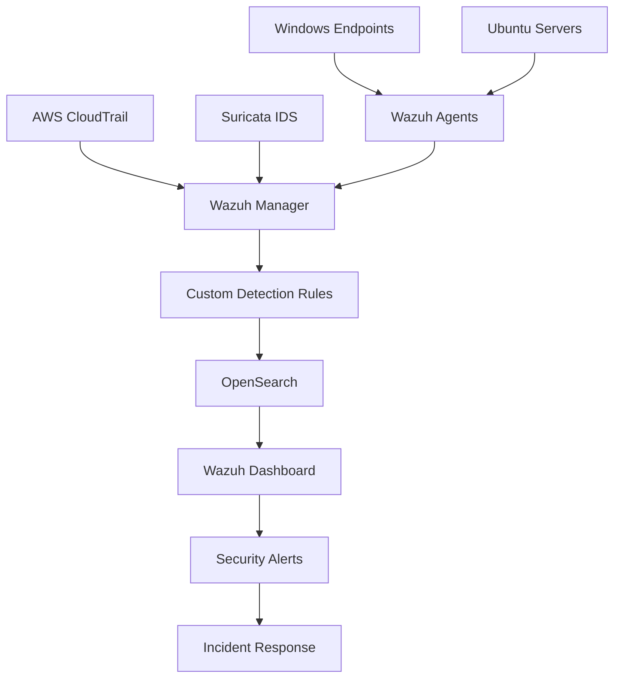
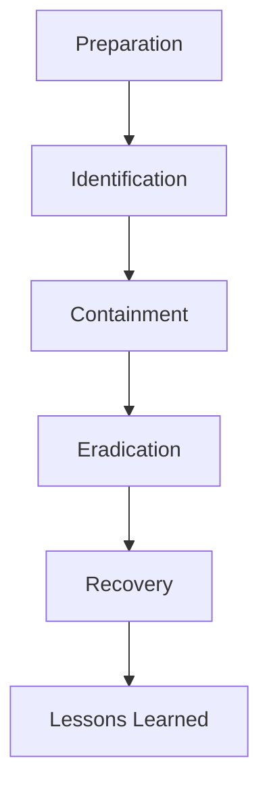

<div align="center">

# 🛰️ FireOps Security Monitoring Environment

### Enterprise Security Monitoring • SIEM • Detection Engineering • Incident Response

*A security monitoring platform built using **Wazuh**, **OpenSearch**, **Suricata**, **Docker**, and **Tailscale** to simulate enterprise-grade threat detection and response.*

---


</div>

---

# 📖 Overview

The **FireOps Security Monitoring Environment** simulates an enterprise security monitoring infrastructure capable of collecting, correlating, and analysing security telemetry from multiple systems.

The solution combines endpoint monitoring, intrusion detection, log aggregation and alerting into a single platform capable of detecting malicious activity and supporting incident response.

---

# 🎯 Business Scenario

A growing organisation required centralised visibility across its infrastructure.

The existing environment lacked:

- ❌ Centralised logging
- ❌ Endpoint visibility
- ❌ Network intrusion detection
- ❌ Cloud activity monitoring
- ❌ Security alerting
- ❌ Incident response capability

The FireOps platform was designed to close these visibility gaps by implementing a layered security monitoring architecture.

---

# 🏗️ Solution Architecture

The monitoring platform consists of four logical layers.

| Layer | Components |
|--------|------------|
| **Log Sources** | Windows Endpoints, Ubuntu Servers, AWS CloudTrail, Suricata |
| **Collection & Detection** | Wazuh Agents, Wazuh Manager, Detection Rules |
| **Storage & Analytics** | OpenSearch |
| **Visualisation & Response** | Wazuh Dashboard, Email Alerts, Incident Response |



---

# 🚀 Core Features

✅ Centralised log collection

✅ Endpoint monitoring

✅ Network intrusion detection

✅ Cloud telemetry monitoring

✅ Custom Wazuh detection rules

✅ Security alerting

✅ Incident response workflows

✅ Secure remote connectivity using Tailscale

---

# 🛠️ Technology Stack

| Technology | Purpose |
|------------|---------|
| Wazuh | SIEM Platform |
| OpenSearch | Log Storage & Search |
| Suricata | Network IDS |
| Docker | Containerisation |
| Ubuntu | Monitoring Server |
| Windows | Endpoint Telemetry |
| AWS CloudTrail | Cloud Monitoring |
| Tailscale | Secure Connectivity |
| Hydra | SSH Brute-force Simulation |
| Nmap | Network Reconnaissance |

---

# 🧪 Attack Simulations

## SSH Brute Force

```bash
hydra -l admin -P passwords.txt TARGET_IP ssh
```

**Objective**

Validate authentication monitoring.

---

## Network Reconnaissance

```bash
nmap -sS -sV TARGET_IP
```

**Objective**

Validate network intrusion detection.

---

## Privilege Escalation

Administrative commands using `sudo` were executed to validate privileged activity monitoring.

---

# 🚨 Incident Response Workflow



---

# 📈 Project Outcomes

- ✅ Centralised security telemetry
- ✅ Successful attack detection
- ✅ Custom detection engineering
- ✅ Automated alert generation
- ✅ Incident response procedures
- ✅ Historical log retention
- ✅ Enterprise monitoring architecture

---

# 💼 Skills Demonstrated

### Security Operations

- SIEM Deployment
- Detection Engineering
- Threat Monitoring
- Incident Response

### Infrastructure

- Docker
- Linux
- Windows Administration
- OpenSearch

### Detection

- Wazuh Rules
- Suricata IDS
- Authentication Monitoring
- Network Monitoring

### Offensive Validation

- Hydra
- Nmap
- Privilege Escalation Testing

---

# 📂 Repository Structure

```text
01-fireops-monitoring-environment/
│
├── architecture/
├── detection-rules/
├── docs/
├── evidence/
├── implementation/
├── incident-response/
├── presentations/
├── reports/
├── screenshots/
├── scripts/
├── suricata/
└── wazuh/
```

---

# 📚 Documentation

Additional documentation is available in:

```
docs/
```

---

# ⚠️ Limitations

- Laboratory deployment
- Limited cloud integrations
- Controlled attack scenarios
- Single monitoring environment

---

# 🔮 Future Enhancements

- Multi-site deployment
- Additional cloud providers
- Threat intelligence feeds
- Automated containment
- SOAR integration
- Executive dashboards
- High availability
- Role-based access control

---

# 🎓 Project Context

Developed as part of the **Expadox Lab Project-Based Mentorship Program (Cohort 2 – 2026)**.

---

<div align="center">

**Enterprise Security Monitoring | Detection Engineering | Incident Response**

</div>
